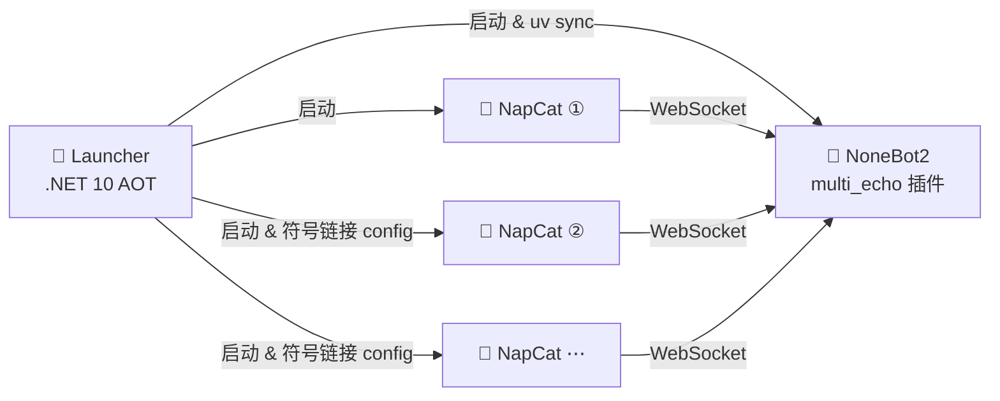

<h1 align="center">🔊 MultiEcho</h1>

<p align="center">
  可拓展的多账号 QQ 群消息复读机器人
</p>

<p align="center">
  <a href="https://github.com/BoolCox/MultiEcho/issues"></a>
  <a href="https://github.com/BoolCox/MultiEcho/blob/master/LICENSE"></a>
  <a href="https://dotnet.microsoft.com"></a>
  <a href="https://nonebot.dev"></a>
</p>

---

## ✨ 功能特性

| 特性 | 说明 |
|------|------|
| 🤖 多账号管理 | 同时运行多个 NapCat 实例，每个实例独立登录不同账号 |
| 🔁 自动复读 | 被跟随用户在白名单群内发送 `@某人 纯数字` 消息时，机器人自动复读 |
| 🔐 权限体系 | 超级管理员 / 管理员两级权限，灵活管控 |
| 🧩 按账号隔离 | 管理员、群白名单、跟随规则、延迟均按机器人账号独立存储 |
| ⏱️ 可调延迟 | 支持为复读设置 0 ~ 30000 ms 的延迟 |

> 📖 详细的命令列表与使用流程请查看 [Bot 使用说明](./multi_echo/docs/multi_echo_usage.md)

---

## 🏗️ 技术架构

本项目由三个部分协同工作：



> **Launcher 的职责：**
> 1. 扫描所有 `napcat*` 文件夹，将第 2 个及之后的实例的 `config` 目录符号链接到第 1 个实例，实现配置共享。
> 2. 检查 NoneBot 虚拟环境，若不存在则自动执行 `uv sync` 安装依赖。
> 3. 启动 NoneBot2 进程和所有 NapCat 实例，并监控运行状态。
> 4. 自动捕获 NapCat 的 WebUI 地址并在浏览器中打开，方便登录。

---

## 📁 项目结构

```
MultiEcho/
├── Launcher/               # .NET 10 启动器（AOT 单文件发布）
│   ├── Launcher.slnx
│   ├── Launcher.csproj
│   └── app.manifest
├── multi_echo/             # NoneBot2 插件（Python）
│   ├── pyproject.toml
│   ├── src/plugins/        # 插件源码
│   └── docs/               # 使用说明
├── build/                  # 构建产物输出（自动生成）
└── README.md
```

---

## 🚀 用户指南

### 1. 下载程序

1. 前往 [Releases 页面](https://github.com/BoolCox/MultiEcho/releases/tag/1.0.0) 下载最新的压缩包。
2. 将压缩包解压到任意目录。

### 2. 安装依赖

- 安装 [uv](https://github.com/astral-sh/uv)（Python 包管理器）。

### 3. 启动程序

1. 双击 `Launcher.exe`。
2. 在弹出的浏览器页面上登录账号。

> **提示**
> - 如果启动程序显示 `waiting` 字样，可关闭后重新打开。
> - 若启动程序卡住，按一下回车即可恢复。

### 4. 多账号启动

如需同时登录多个账号：

1. 复制安装目录中任意一个 `napcat` 文件夹，重命名为 `napcat2`（或 `napcat3`、`napcat10` 等）。
2. 为每个 `napcatX` 实例分别进行登录与网络配置。
3. ⚠️ **不要**在"系统配置 → 登录配置"里设置快速登录，以避免所有实例登录同一个账号。

### 5. 首次登录的网络配置

每个账号首次登录时，在网页左侧进行如下操作：

1. 进入 **网络配置** → **新建** → **WebSocket 客户端**。
2. 填入地址：`ws://localhost:8080/onebot/v11/ws`
3. 勾选 **启用** → 点击 **保存**。

### 6. 账号风控与重登

如果账号被风控需要重新登录：

- 在对应网页的 **系统配置 → 登录配置** 中点击 **重启进程**，刷新网页即可重新登录。

---

## 🛠️ 开发者构建指南

### 环境要求

| 工具 | 版本要求 |
|------|---------|
| [.NET SDK](https://dotnet.microsoft.com/download) | 10.0 或更高 |
| [uv](https://github.com/astral-sh/uv) | 最新版 |
| Python | ≥ 3.10, < 4.0 |
| 操作系统 | 默认 Windows x64（可在 `Launcher.csproj` 中修改 `RuntimeIdentifier`） |

### 构建步骤

```bash
git clone https://github.com/BoolCox/MultiEcho.git
cd MultiEcho
dotnet publish Launcher/Launcher.csproj -c Release
```

`dotnet publish` 会自动完成 AOT 编译并组装 `build/` 目录（Launcher + NoneBot 插件 + NapCat 下载解压），构建完成后将 `build/` 目录整体分发即可使用。

### 开发 NoneBot 插件

```bash
cd multi_echo
uv sync                # 安装依赖
uv sync --extra dev    # 安装开发依赖（pyright、ruff）
```

### 自定义 NapCat 版本

在 `Launcher/Launcher.csproj` 中修改 `NapcatVersion` 属性：

```xml
<NapcatVersion>v4.16.0</NapcatVersion>
```

---

## 💬 问题反馈

遇到 Bug 或有功能建议？欢迎 [提交 Issue](https://github.com/BoolCox/MultiEcho/issues/new)。
